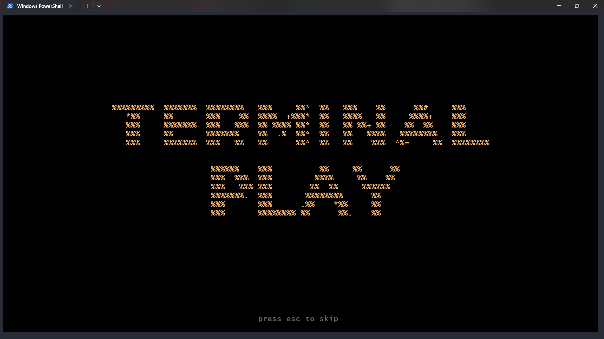
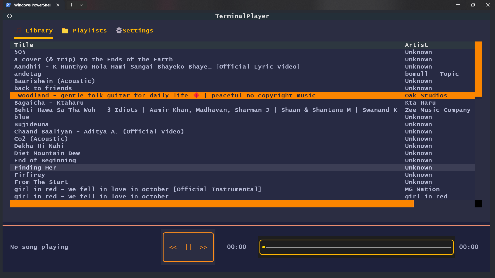
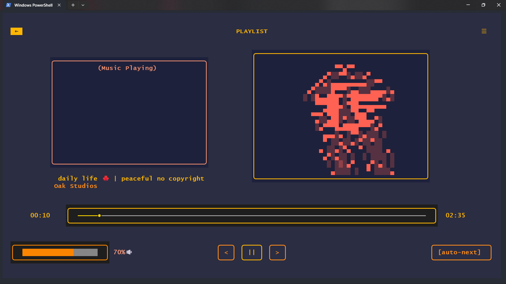

# Terminal Play


**A music player for your terminal.** Build with python with textual library for those beautiful UI and pygame for playing the actual audio.

## Custom Features
* **Custom loading animation:** I made that animation in davinci then used .mov to ascii script to convert it into that beautiful animation.

* **Beautiful TUI:** I think the TUI (Terminal User Interface) looks beautiful (I'm not a good designer thooo), feel free for suggestions.

* **Animations:** I added some animations like in when songs are playing, right side of the screen will play a dancing character animation.

#
### Some more screenshots




#### First time writing README so idk what to write.. I will learn gradually (trust me)

### For source code building
1) Make sure you install the requrements first
```
pip install -r requirements.txt
```
2) Then u can run:
```
 pyinstaller --noconfirm --onefile --console --exclude-module PyQt5 --exclude-module PySide6 --collect-all textual --collect-all pyfiglet --add-data "assets;assets" main.py
 ```